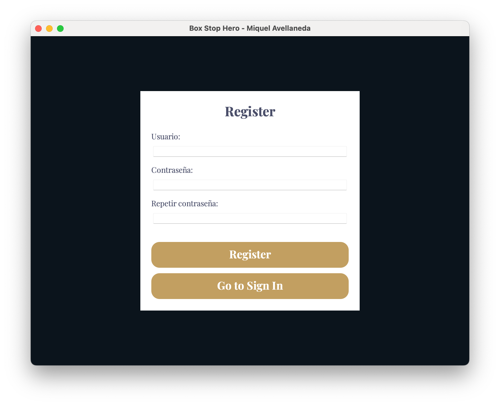

# Box Stop Hero 🏁⌨️

**Autor:** Miquel Avellaneda  
**Versión:** 1.1  
**Tecnologías:** Java, Swing, MySQL  

---

## 🎮 ¿Qué es *Box Stop Hero*?

*Box Stop Hero* es un juego de mecanografía diseñado especialmente para amantes de la Fórmula 1. Combina la adrenalina de un pit stop con la práctica de la escritura rápida y precisa en teclado.

Ponte en la piel de un mecánico de boxes y demuestra que eres el más rápido tecleando. Cuanto más rápido escribas las palabras correctamente... ¡más rápido saldrá tu coche de boxes!

---

## 🧠 Objetivo

El objetivo del juego es escribir correctamente las palabras que aparecen en pantalla lo más rápido posible. Cada segundo cuenta para mejorar tu tiempo y escalar posiciones en el ranking global.

---

## 🚀 Características

- Interfaz moderna y visual con Java Swing.
- Palabras clasificadas por dificultad (Fácil, Media, Difícil).
- Ranking global con los 10 mejores tiempos.
- Guardado automático de las partidas en base de datos.
- Cuenta regresiva inicial para entrar en modo competición.
- Diseño inmersivo con estética de Fórmula 1.

---

## 🛠️ Tecnologías utilizadas

- **Java 17**  
- **Swing** para la interfaz gráfica  
- **MySQL** para guardar usuarios, partidas y estadísticas  
- **Maven** (opcional) para gestión de dependencias

---

---

## 🧑‍💻 Instalación y ejecución

1. Clona el repositorio:
   ```bash
   git clone https://github.com/miquelavellaneda/box-stop-hero.git
   ```
2. Ejecutar el archivo
   ```bash
   src/Main.java
   ```
3. Disfurtar del juego

---

--- 

## 🏞️ Capturas del juego



